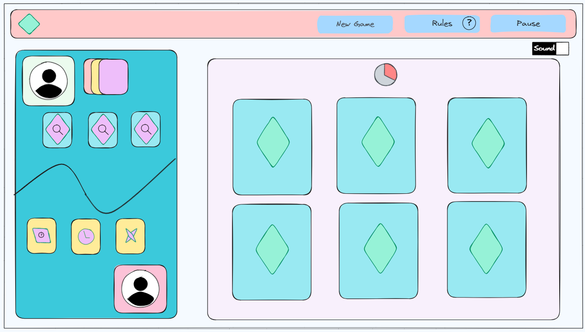
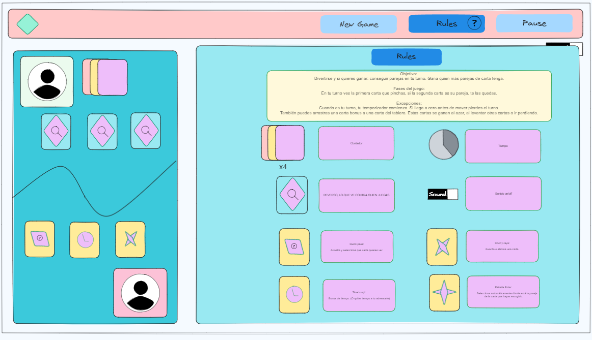

# Memory-Game
A fun twist to the classic memory game. I made this to practice my vanilla Js skills and play with the design tools and Bootstrap. 

## Table of Contents
* [Instructions](#instructions)
* [Wireframe](#wireframe)
* [Contributing](#contributing)
* [How to play](#how-to-play)
* [Dependencies](#dependencies)
* [Author](https://github.com/spariva)
* [License](#license)

## Instructions
To get started, open `index.html` and start playing.

## Wireframe
https://excalidraw.com/#json=AwEwVknCUaSenSDV31utH,9YsoEsz3U2sdYki9MXQffQ

## Contributing
I would love if this repository inspire you in any way, so feel free to fork and twink with the code.
 >Although, I will leave my original version in one branch. But I most likely will accept pull requests.

## How to play
Having fun is the most important thing, but if you also wanna win, then collect as many matching cards as you can. 
In your turn you pick two cards, in case they match, you collect them. 

>I added some exceptions, as a timer and bonus cards
>The bonus cards might change the game, as they allow you to peek some cards, delete them, auto-complete a matching set or steal time from your opponent.

### How do I win bonus cards?
They might appear once you pick some cards, or you might gain them if you are losing. 
>If you plan to fork this repo, feel free to get creative in this section!

